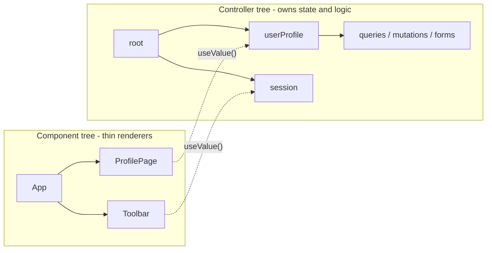
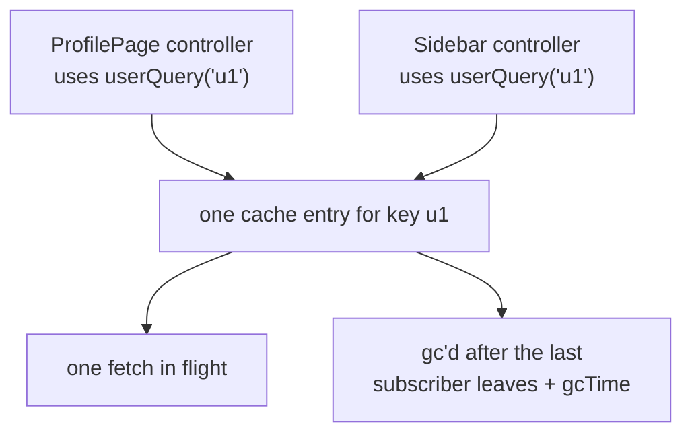

# Olas

**State and logic that lives outside the UI tree.**

Olas pulls everything that *isn't* rendering — fetching, mutations, forms, business rules, cross-screen coordination — into a parallel tree of typed controllers. Your components stay thin and your logic becomes plain TypeScript you can read top to bottom and test without spinning up a renderer.

```ts
import { defineController, signal } from '@kontsedal/olas-core'

export const counter = defineController(() => {
  const count = signal(0)
  return {
    count,
    increment: () => count.update((n) => n + 1),
  }
})
```

That's a controller: a function that returns an object. Components subscribe to it, call its methods, and do not own its lifetime.

Because it's *a function*, here's the entire test — no renderer, no jsdom, no Testing Library:

<!-- snippet-prelude
import { counter } from './counter'
-->
```ts
import { createTestController } from '@kontsedal/olas-core/testing'
import { expect, test } from 'vitest'

test('counter increments', () => {
  const { api } = createTestController(counter, { deps: {} })
  api.increment()
  expect(api.count.peek()).toBe(1)
})
```

Scale that controller up — shared queries, optimistic mutations with rollback, whole forms — and the test *still* never boots a DOM. That's the pitch in one line: **your app's logic becomes plain TypeScript you can read top to bottom and test like any other function.**

---

## Table of contents

- [Why](#why)
- [Install](#install)
- [A five-minute tour](#a-five-minute-tour)
  - [Signals — typed boxes that notify](#1-signals--typed-boxes-that-notify)
  - [Controllers — group state and behavior](#2-controllers--group-state-and-behavior)
  - [Reading from React](#3-reading-from-react)
  - [Async data with `defineQuery`](#4-async-data-with-definequery)
  - [Writes with mutations](#5-writes-with-mutations)
  - [Forms](#6-forms)
- [Common patterns](#common-patterns)
- [Tooling](#tooling)
- [Working with AI assistants](#working-with-ai-assistants)
- [How it scales](#how-it-scales)
- [Packages](#packages)
- [Examples](#examples)
- [How it compares](#how-it-compares)
- [Learn more](#learn-more)
- [Commands](#commands)

---

## Why

Most apps end up in one of three places:

1. **State inside components.** Easy at first. At scale it sprawls — the same data fetched twice, side effects tangled with renders, tests boot a renderer to verify a single rule.
2. **One big store.** Scalable but blunt. Everything is global, ownership is implicit, lifetimes are forever.
3. **Hooks at the top of pages.** Hides ownership. Two pages mounting the same hook re-fetch instead of sharing. Lifecycle is "whatever React does."

Olas takes a different shape. There's a **controller tree** that mirrors your app's *features* (not your component tree). Each controller owns its slice — its signals, its queries, its mutations — and is disposed explicitly when the feature unmounts. Components are read-only renderers that subscribe to controllers via small adapter hooks.



Two trees, one arrow between them: components reach *into* the controller tree to read a signal, and that's the entire coupling. The logic doesn't know a component exists.

The practical wins:

- **Logic without renderers.** A controller is a function. Tests pass in fake `deps`, call methods, and assert against signals. No `render(<App />)`, no Testing Library, no fake timers chasing effect flushes.
- **Explicit lifetimes.** Every field, query, mutation, and child controller dies with its parent. No "what owns this subscription?" mystery.
- **Shared queries by default.** Two controllers subscribing to the same query share one fetch and one cache entry. The same primitive scales from "one widget" to "every screen on the dashboard."
- **Framework-agnostic core.** `@kontsedal/olas-core` declares no UI-framework dependency and does not import one. The React, Vue and Svelte adapters are thin layers: React's sits on `useSyncExternalStore`, Vue's turns a signal into a read-only ref, and in Svelte a signal already is a store. Preact runs the React adapter through `preact/compat`, and plain DOM code subscribes to signals directly.

---

## Install

```bash
pnpm add @kontsedal/olas-core @kontsedal/olas-react @preact/signals-core react
# Vue or Svelte instead of React:
pnpm add @kontsedal/olas-core @kontsedal/olas-vue @preact/signals-core vue
pnpm add @kontsedal/olas-core @kontsedal/olas-svelte @preact/signals-core svelte
# optional add-ons (each independent — pick what you use)
pnpm add @kontsedal/olas-persist @kontsedal/olas-zod @kontsedal/olas-devtools zod
pnpm add @kontsedal/olas-cross-tab @kontsedal/olas-entities @kontsedal/olas-realtime
pnpm add @kontsedal/olas-mutation-queue @kontsedal/olas-router
# lint rules for the conventions below
pnpm add -D @kontsedal/olas-eslint-plugin eslint
```

`@preact/signals-core` is a peer dep on `@kontsedal/olas-core` — the library does not bundle it.

Every package ships ES modules only and needs Node 20.19 or later, where `require()` of an ES module works.

---

## A five-minute tour

Six concepts, each smaller than the last. By the end you can read any Olas codebase.

### 1. Signals — typed boxes that notify

```ts
import { signal, computed, effect } from '@kontsedal/olas-core'

const count = signal(0)
const double = computed(() => count.value * 2)

count.set(5)
console.log(double.value)         // 10

effect(() => {
  console.log('count is', count.value)
})
count.update((n) => n + 1)        // logs "count is 6"
```

A `signal` is a typed cell. Read it with `.value`; write with `.set(...)` or `.update(fn)`. `computed(...)` derives a read-only signal that recomputes when its dependencies change. `effect(...)` runs side effects, re-running when *its* dependencies change.

Olas wraps [`@preact/signals-core`](https://github.com/preactjs/signals) behind these types. It's small (~1 kB), fast, and glitch-free.

### 2. Controllers — group state and behavior

A controller is a function from `ctx` to an API object.

```ts file=counter.ts
// counter.ts
import { defineController, signal } from '@kontsedal/olas-core'

export const counter = defineController((ctx) => {
  const count = signal(0)

  ctx.effect(() => {
    document.title = `Count: ${count.value}`
  })

  return {
    count,
    increment: () => count.update((n) => n + 1),
    reset: () => count.set(0),
  }
})
```

`ctx` is bound to *this* controller's lifetime. Anything created through `ctx` or the `create*` functions that take it — effects, child controllers, fields, queries, mutations, emitters — is disposed when the controller is disposed.

Mount the controller as a root once, near your app entry point.

```ts
import { createRoot } from '@kontsedal/olas-core'
import { counter } from './counter'

const root = createRoot(counter, { deps: {} })

root.api.increment()
console.log(root.api.count.value) // 1

root.dispose()                    // tears down the effect, signals, everything
```

`createRoot` returns a handle. The controller's api is on `root.api`, and the root's own controls sit beside it: `dispose`, `suspend`, `resume`, `dehydrate`, `hydrate`, `waitForIdle`, `bindQuery`, `inject` and `debug`.

`deps` is required (more on this in [Dependency injection](#dependency-injection)). For trivial apps, `{}` is fine.

### 3. Reading from React

```tsx
// main.tsx
import { createRoot as createReactRoot } from 'react-dom/client'
import { createRoot as createOlasRoot } from '@kontsedal/olas-core'
import { OlasProvider } from '@kontsedal/olas-react'
import { counter } from './counter'
import { App } from './App'

const root = createOlasRoot(counter, { deps: {} })

// Register the root's type once, so `useRoot()` needs no type argument.
declare module '@kontsedal/olas-react' {
  interface Register {
    root: typeof root
  }
}

createReactRoot(document.getElementById('root')!).render(
  <OlasProvider root={root}>
    <App />
  </OlasProvider>
)
```

```tsx file=App.tsx
// App.tsx
import { useRoot, useValue } from '@kontsedal/olas-react'

export function App() {
  const api = useRoot()
  const count = useValue(api.count)

  return (
    <div>
      <p>{count}</p>
      <button onClick={api.increment}>+</button>
      <button onClick={api.reset}>reset</button>
    </div>
  )
}
```

`useValue(signal)` subscribes a component to one signal. `useRoot()` resolves the root's api from the provider, typed through the `Register` augmentation in `main.tsx`. Without one it returns `unknown`, and `useRoot<Api>()` names the type per call, as §4 does. The component is a thin renderer — all behavior lives on `api`.

Vue and Svelte read the same controller. `@kontsedal/olas-vue` installs the root with `app.use(olasPlugin(root))` and returns refs, and `@kontsedal/olas-svelte` puts it in context with `setRoot(root)`. See [Packages](#packages).

### 4. Async data with `defineQuery`

For data that comes from the network and might be shared across screens, define a query at module scope:

```ts file=queries.ts
// queries.ts
import { defineQuery } from '@kontsedal/olas-core'

export const userQuery = defineQuery({
  id: 'users/detail', // required, unique, and the same in the server and client bundles
  key: (id: string) => [id],
  fetcher: async ({ signal }, id) => {
    const res = await fetch(`/api/users/${id}`, { signal })
    if (!res.ok) throw new Error(res.statusText)
    return res.json() as Promise<{ id: string; name: string; email: string }>
  },
  staleTime: 30_000,
})
```

The `id` names the query everywhere a query has to be found by name: SSR payloads, plugins and devtools. Write it by hand, because a derived name changes under minification.

Subscribe to it from a controller. `createQuery` returns an `AsyncState<T>`: ten signals you can read one at a time, such as `data`, `error`, `isLoading` and `isFetching`, plus `refetch`, `cancel`, `reset` and `firstValue`.

```ts file=userProfile.ts
// userProfile.ts
import { createQuery, type CtrlApi, defineController } from '@kontsedal/olas-core'
import { userQuery } from './queries'

export const userProfile = defineController((ctx, props: { id: string }) => {
  const user = createQuery(ctx, userQuery, () => [props.id])

  return { user }
})

export type UserProfileApi = CtrlApi<typeof userProfile>
```

A root whose controllers create a query or a mutation needs a query engine: `createRoot(app, { deps, queries: queryEngine() })`. Without one, `createQuery` throws an error that names the fix. A root with no queries leaves the engine out, and its bundle leaves out the query cache.

In a component, `useQuery` reads the whole state in one hook, and re-renders only when a field the component read changes:

```tsx
import { useQuery, useRoot } from '@kontsedal/olas-react'
import { ErrorBox, Spinner } from './ui'
import type { UserProfileApi } from './userProfile'

export function UserCard() {
  const api = useRoot<UserProfileApi>()
  const { data, isLoading, error } = useQuery(api.user)

  if (isLoading) return <Spinner />
  if (error) return <ErrorBox error={error} />
  return <h1>{data?.name}</h1>
}
```

`useSuspenseQuery(api.user)` is the Suspense form: it suspends until the first value lands, and its `data` is never `undefined`.

**Two controllers subscribing to the same `userQuery` with the same key share one fetch and one cache entry.** When the last subscriber disposes, the entry is collected after `gcTime`, which defaults to five minutes.



You do not wire this up. Subscribing *is* the sharing. The same primitive scales from one widget to every screen on a dashboard.

### 5. Writes with mutations

```ts
import { bindQuery, createMutation, createQuery, defineController } from '@kontsedal/olas-core'
import { userQuery } from './queries'

export const userProfile = defineController((ctx, props: { id: string }) => {
  const user = createQuery(ctx, userQuery, () => [props.id])

  const users = bindQuery(ctx, userQuery)
  const updateName = createMutation<string, void>(ctx, {
    mutate: async (newName, { signal }) => {
      const res = await fetch(`/api/users/${props.id}`, {
        method: 'PATCH',
        body: JSON.stringify({ name: newName }),
        signal,
      })
      if (!res.ok) throw new Error('save failed')
    },
    onMutate: (newName) => {
      users.cancel(props.id) // stop an in-flight refetch from clobbering the optimistic write
      return users.setData(props.id, (prev) => {
        if (!prev) throw new Error('updateName before user loaded')
        return { ...prev, name: newName }
      })
    },
  })

  return { user, updateName }
})
```

`onMutate` runs an optimistic update *before* the network call and returns a snapshot. It first calls `users.cancel(...)`, where `users` is the root-scoped handle from `bindQuery(ctx, userQuery)`, so an outgoing refetch's stale response cannot land on top of the optimistic value. If the call fails, the mutation rolls the snapshot back after `onError` runs, and the UI reverts. On success it finalizes the snapshot. Rollback restores server truth when a fetch succeeded in between; see SPEC §6.4.

`mutate` receives the variables and a context with the run's `signal` and the controller's `deps`.

Three concurrency modes (`parallel` is default):

- `parallel` — every `.run(...)` is independent.
- `latest-wins` — a new `.run(...)` aborts the in-flight one.
- `serial` — runs queue up and execute one at a time.

### 6. Forms

```ts
import {
  createField,
  createForm,
  createMutation,
  defineController,
  email,
  minLength,
  required,
} from '@kontsedal/olas-core'

export const signupForm = defineController((ctx) => {
  const form = createForm(ctx, {
    name: createField(ctx, '', { validators: [required('Name is required')] }),
    email: createField(ctx, '', { validators: [required(), email()] }),
    password: createField(ctx, '', { validators: [minLength(8, 'Min 8 characters')] }),
  })

  return {
    form,
    submit: createMutation<void, void>(ctx, {
      mutate: async () => {
        form.markAllTouched()
        if (!(await form.validate())) throw new Error('invalid')
        const v = form.value
        // ...send v.name, v.email, v.password to the server
      },
    }),
  }
})
```

A `Form` aggregates fields (and nested forms, and `FieldArray`s) and is itself a `ReadSignal` of their typed value, like a `Field`. It adds `isValid`, `isDirty`, `touched` and `isValidating`. `form.submit(handler)` is the shortcut when you need no mutation state: it validates first and resolves a `SubmitResult` you switch on. Components subscribe one field at a time with `useField`:

```tsx
import type { Field } from '@kontsedal/olas-core'
import { useField } from '@kontsedal/olas-react'

export function NameInput({ field }: { field: Field<string> }) {
  const f = useField(field)
  return (
    <label>
      <span>Name</span>
      <input value={f.value} onChange={(e) => f.set(e.target.value)} onBlur={f.markTouched} />
      {f.touched && f.errors[0] && <em>{f.errors[0]}</em>}
    </label>
  )
}
```

For schema-driven forms, `@kontsedal/olas-zod` walks a `z.object(...)` tree and emits the matching `Form`, `Field` and `FieldArray` structure with validators auto-attached:

<!-- snippet-prelude
import type { Ctx } from '@kontsedal/olas-core'
declare const ctx: Ctx
-->
```ts
import { z } from 'zod'
import { createZodForm } from '@kontsedal/olas-zod'

const Schema = z.object({
  name: z.string().min(2),
  age: z.number().min(0),
})

const form = createZodForm(ctx, Schema)
// form is a ReadSignal<{ name: string; age: number }>
```

That's the whole tour. Everything else in Olas is variations on these six pieces.

---

## Common patterns

The everyday wiring. For composable custom hooks — debounced writes, pagination, inline edit, realtime patching, router integration — see [RECIPES.md](RECIPES.md).

### Dependency injection

`deps` is a typed object passed to `createRoot` and available everywhere as `ctx.deps`. Use it for anything the app talks to externally (api clients, routers, analytics, the current time).

```ts
// deps.ts
import type { Emitter } from '@kontsedal/olas-core'

export type User = { id: string; name: string }

export interface AppDeps {
  api: { getUser(id: string): Promise<User> }
  router: { navigate(path: string): void }
  activity: Emitter<string>
}

declare module '@kontsedal/olas-core' {
  interface AmbientDeps extends AppDeps {}
}
```

```ts
import { createEmitter, createRoot, queryEngine } from '@kontsedal/olas-core'
import { appController } from './app.controller'
import { realApiClient, realRouter } from './services'

const root = createRoot(appController, {
  // App-wide query policy, declared once. A per-query `defineQuery` field
  // always overrides it. Built-ins are staleTime: 0, retry: 0.
  queries: queryEngine({ defaults: { staleTime: 5 * 60_000, retry: 1 } }),
  deps: {
    api: realApiClient,
    router: realRouter,
    activity: createEmitter<string>(),
  },
})
```

In tests, pass in fakes — no mocking framework needed.

### Cross-controller communication — emitters

For "controller A fires an event, controller B reacts," use an emitter on `ctx.deps` (or a `defineScope` for shared in-tree state).

```ts
import { defineController, signal } from '@kontsedal/olas-core'

export const activity = defineController((ctx) => {
  const log = signal<string[]>([])
  ctx.on(ctx.deps.activity, (msg) => log.update((l) => [...l, msg]))
  return { log }
})
```

### Optimistic UI with rollback

Pattern shown above in [§5](#5-writes-with-mutations). The key rule: `onMutate` calls `cancel` on the query, then returns the snapshot `setData` gave it. The mutation settles the snapshot: it rolls back on an error or an abort (a superseded `latest-wins` run, a dispose) and finalizes on success. For a patch that is already true, such as a server push, use `write`, which leaves no snapshot to settle.

### Persisted state

<!-- snippet-prelude
import type { Ctx } from '@kontsedal/olas-core'
declare const ctx: Ctx
-->
```ts
import { signal } from '@kontsedal/olas-core'
import { createPersisted } from '@kontsedal/olas-persist'

const theme = signal<'light' | 'dark'>('light')
createPersisted(ctx, 'theme', theme)
```

`createPersisted` reads the saved value on construction and writes through on every change. Works for any signal-shaped source (`signal`, `field`, or anything exposing `.value`, `.set` and `.subscribe`). Cross-tab sync via `crossTab: true`. `persistQueryCachePlugin` from the same package persists the query cache instead.

### SSR — `dehydrate` and `hydrate`

```tsx
// server.tsx
import { createRoot, queryEngine, serializeForScript } from '@kontsedal/olas-core'
import { OlasProvider } from '@kontsedal/olas-react'
import { renderToString } from 'react-dom/server'
import { App } from './App'
import { appController } from './app.controller'
import { serverDeps } from './deps.server'

export async function render(): Promise<string> {
  const root = createRoot(appController, { queries: queryEngine(), deps: serverDeps })
  await root.waitForIdle() // the controllers' queries started inside createRoot
  const html = renderToString(
    <OlasProvider root={root}>
      <App />
    </OlasProvider>,
  )
  const state = serializeForScript(root.dehydrate())
  root.dispose()
  return `<div id="root">${html}</div><script>window.__OLAS_STATE__ = ${state}</script>`
}
```

```ts
// client.ts
import { createRoot, type DehydratedState, queryEngine } from '@kontsedal/olas-core'
import { appController } from './app.controller'
import { clientDeps } from './deps.client'

const state = (window as { __OLAS_STATE__?: DehydratedState }).__OLAS_STATE__

const root = createRoot(appController, {
  queries: queryEngine(), // the engine owns the cache that `hydrate` seeds
  deps: clientDeps,
  hydrate: state,
})
```

`dehydrate()` serializes every successful entry of every query and infinite query, keyed by the query's `id`. Hydrated queries respect `staleTime`; fresh entries skip the initial refetch. The client root needs `queries: queryEngine()`: a root without an engine has no cache, so it discards the payload, and development builds warn. `serializeForScript` escapes the payload for an inline `<script>`, so data containing `</script>` cannot end the tag. For streaming SSR, `@kontsedal/olas-react` ships `createStreamingHydrator`, which takes a CSP `nonce`.

Use `bindQuery(ctx, query)` inside controllers or `root.bindQuery(query)` outside them for imperative cache operations. The returned handle targets one root and can prefetch before any subscription exists. Unbound query methods throw (or reject their promise) when multiple roots have touched the query. See [the migration notes](MIGRATING.md#upgrading-from-08-to-10).

---

## Tooling

### Devtools

```tsx
import { DevtoolsLauncher } from '@kontsedal/olas-devtools'
import { OlasProvider } from '@kontsedal/olas-react'
import { App } from './App'
import { root } from './root'

export const tree = (
  <OlasProvider root={root}>
    <App />
    {import.meta.env.DEV && <DevtoolsLauncher root={root} />}
  </OlasProvider>
)
```

A floating button opens a panel over `root.debug`: the controller tree, a timeline of cache and mutation events, the cache, an inspector, the mutation log and the fields. Press `/` to search it. Events a plugin sends through `host.debug` get their own lane on the timeline. Gate the launcher behind `import.meta.env.DEV` so production builds leave it out.

### Lint rules

`@kontsedal/olas-eslint-plugin` checks the conventions the types cannot see. Its eight rules catch a React hook inside a controller factory, a `defineQuery` or `defineMutation` built inside a function, and an `async` factory. They also catch an optimistic `setData` with no `cancel` before it, a snapshot `onMutate` does not return, and `@kontsedal/olas-core/testing` imported outside a test. Two opt-in rules catch `fetch` inside a component, and a fetcher or `mutate` that does not pass its `signal` on.

```js
// eslint.config.js
import olas from '@kontsedal/olas-eslint-plugin'
import tseslint from 'typescript-eslint'

export default [...tseslint.configs.recommended, olas.configs.recommended]
```

`recommended` turns on six rules. `strict` adds `no-network-in-components` and `honor-abort-signal`, and raises `cancel-before-optimistic` from a warning to an error. The rules read syntax only, so they need no type information. The [package README](packages/eslint-plugin) lists each rule.

### Upgrading from 0.8

`@kontsedal/olas-codemod` rewrites the mechanical 0.8 → 1.0 changes and lists the sites that need a person:

```bash
npx @kontsedal/olas-codemod 1.0
```

Run it on a clean git tree, with the 0.8 packages still installed. [MIGRATING.md](MIGRATING.md#upgrading-from-08-to-10) covers what it changes and what it leaves to you.

---

## Working with AI assistants

Because controllers are pure TypeScript with no renderer involvement, AI coding assistants (Claude Code, Cursor, Copilot Workspace) can work on business logic in isolation:

- Hand the assistant `someController.ts` plus its test file. It iterates with `pnpm vitest run packages/foo/tests/someController.test.ts` against `createTestController` — no jsdom, no Testing Library, no fake DOM tree.
- For UI work, export `type FooApi` from the controller and hand it plus the React file to the assistant. It maps `api.foo.run()` to a button without needing to understand the optimistic-rollback logic happening behind it.

Foundation models default to React/Redux idioms — without rules pinning Olas's invariants ("UI doesn't fetch", "controllers stay synchronous", "tests don't render"), output drifts. The repo ships:

- [`.cursorrules`](.cursorrules) — short rules file that Cursor (and other rule-aware assistants) injects per prompt.
- [`@kontsedal/olas-eslint-plugin`](packages/eslint-plugin) — the same invariants as lint errors, so drift fails the build instead of a review.
- [`CLAUDE.md`](CLAUDE.md) — long-form operating instructions for AI assistants working *on* the framework itself (wiki schema, BACKLOG protocol, codebase-specific gotchas).

For projects building *with* Olas, copy `.cursorrules` into your repo and trim to your conventions.

---

## How it scales

| Concern | What changes as the app grows |
|---|---|
| **Many features** | Add more controllers; compose them via `ctx.child(...)`. The tree mirrors features, not screens. |
| **Shared data** | `defineQuery` at module scope. Multiple subscribers share one fetch automatically. |
| **Many roots / tests in parallel** | Each `createRoot(...)` is isolated; query entries live per-root. Tests run in parallel without leaking state. |
| **User-driven sub-trees** | `ctx.attach(...)` gives you a child controller plus a `dispose()` handle — close the panel, the sub-tree (and its subscriptions) goes with it. |
| **Cross-tree config** | `defineScope<T>()` + `ctx.provide(scope, value)` / `ctx.inject(scope)` — typed cross-tree data without prop drilling. |
| **Cross-cutting behavior** | Plugins, from `definePlugin({ name, setup(host) })`, observe every cache write and mutation, wrap fetches and mutations, and provide services through scopes. [PLUGINS.md](PLUGINS.md) is the authoring guide. |

For more depth, every concept above maps to a section in [`SPEC.md`](SPEC.md).

---

## Packages

| Package | What it gives you |
|---|---|
| [`@kontsedal/olas-core`](packages/core) | Everything: signals, controllers, queries, mutations, forms, scopes, plugins, SSR, devtools event bus. Test helpers on `@kontsedal/olas-core/testing`. |
| [`@kontsedal/olas-react`](packages/react) | React adapter — `OlasProvider`, `useRoot`, `useValue`, `useQuery`, `useSuspenseQuery`, `useInfiniteQuery`, `useField`, `useMutation`, `SuspendOnUnmount`, `useSuspendOnHidden`, `HydrationBoundary`, streaming SSR. Runs under Preact through `preact/compat`. |
| [`@kontsedal/olas-vue`](packages/vue) | Vue 3 adapter — `olasPlugin`, `useRoot`, and `useValue`, `useQuery`, `useInfiniteQuery`, `useField` and `useMutation` as refs. |
| [`@kontsedal/olas-svelte`](packages/svelte) | Svelte adapter — `setRoot` / `getRoot`, plus `queryStore`, `infiniteQueryStore`, `fieldStore` and `mutationStore`. A signal is a Svelte store as it is. |
| [`@kontsedal/olas-persist`](packages/persist) | `createPersisted` for a signal, `persistQueryCachePlugin` for the query cache, over `localStorageAdapter()` or `indexedDbAdapter()`. |
| [`@kontsedal/olas-zod`](packages/zod) | `zodValidator(schema)` + `createZodForm(ctx, schema)`. |
| [`@kontsedal/olas-devtools`](packages/devtools) | In-app `<DevtoolsPanel>` + floating launcher consuming `root.debug`. |
| [`@kontsedal/olas-cross-tab`](packages/cross-tab) | `BroadcastChannel`-backed cross-tab cache sync as a plugin. A query opts in with `meta: { crossTab: true }`. |
| [`@kontsedal/olas-entities`](packages/entities) | `defineEntity` + auto-walk + reverse-index backprop for normalized entities across queries. The store is a service: `ctx.inject(Entities)`. |
| [`@kontsedal/olas-realtime`](packages/realtime) | `createRealtimePatcher`, `createLiveStream` and `createConnectionState` over a consumer-supplied `RealtimeService`. |
| [`@kontsedal/olas-mutation-queue`](packages/mutation-queue) | Best-effort, replay-safe mutation queue. Persists runs of a `defineMutation({ meta: { persist: true } })` to a `StorageAdapter`; replays pending entries on reload / crash / reconnect (Web-Locks-coordinated cross-tab). |
| [`@kontsedal/olas-router`](packages/router) | Generic router bridge — `createRouterAdapter()` returns a plugin that provides `RouteParamsScope` / `RouteSearchScope` / `RoutePathnameScope`, and a `Bridge` component that feeds them. Works with TanStack Router or React Router v6. |
| [`@kontsedal/olas-eslint-plugin`](packages/eslint-plugin) | Eight syntax-only lint rules, with `recommended` and `strict` flat configs. |
| [`@kontsedal/olas-codemod`](packages/codemod) | The 0.8 → 1.0 migration: `npx @kontsedal/olas-codemod 1.0`. |

**Versioning.** Each package versions independently. A release bumps only the packages that changed, so version numbers across the suite will not match and are not meant to. Install whichever packages you use at whatever versions npm resolves. Each declares the range of `@kontsedal/olas-core` it works with as a peer dependency, so an incompatible combination fails at install time rather than at runtime.

---

## Examples

Five runnable example apps live in [`examples/`](examples). Each is a real (small) application — not a snippet — with its own dev server.

| App | Stack | What it shows |
|-----|-------|---------------|
| [`stock-ticker`](examples/stock-ticker) | **Vanilla TS** — no UI framework | Signals, computed, effect, emitter, throttled/debounced, `defineQuery` + `refetchInterval`, `createPersisted` watchlist, SVG sparklines. |
| [`kanban`](examples/kanban) | React + Devtools | All three mutation concurrency modes, optimistic snapshot rollback, `createZodForm` + `FieldArray`, `defineScope`, entities, cross-tab sync, realtime, a tracing plugin, error-toast retry, activity feed, mounted `<DevtoolsLauncher>`. |
| [`reader-ssr`](examples/reader-ssr) | React + SSR | `waitForIdle → dehydrate → hydrate` round-trip, paginated `defineQuery`, `useSuspendOnHidden`, `createPersisted` × 3 (bookmarks, theme, reading progress), `onError` root option. |
| [`virtualized-table`](examples/virtualized-table) | React | SPEC §11's "rows are data, not controllers" pattern — 50k-row virtualized table backed by `Map<id, Signal<Row>>`, per-row mutation, devtools-friendly. |
| [`vue-tasks`](examples/vue-tasks) | Vue 3 | One controller with a query, an optimistic toggle, a canonical write and a validated form, read from single-file components. |

```bash
pnpm install
pnpm --filter @kontsedal/olas-example-kanban dev      # or stock-ticker, reader-ssr, virtualized-table, vue-tasks
pnpm --filter @kontsedal/olas-example-kanban test
```

Every example ships a `tests/` suite, and CI runs all five with `pnpm --filter "./examples/*" test`. Most of those tests build a root or call `createTestController` from `@kontsedal/olas-core/testing`, and drive the api in Node. A few render a component, where the rendered output is the thing under test.

---

## How it compares

These are honest, terse sketches. None of them are reasons to leave a tool you're happy with.

**vs. Redux Toolkit and Zustand.** A store is one big object. A controller tree is many small objects, each owning its slice and lifetime. Olas has no reducers, no slices, no selectors — you read signals directly, you call methods directly. The "selector" problem (re-render on unrelated changes) doesn't exist because subscriptions are per-signal.

**vs. TanStack Query + Zustand.** TanStack handles the network; Zustand handles the rest; gluing them together is application code. Olas is one model: queries, mutations, and ephemeral state all live in the same controller, with the same lifetime, in the same place.

**vs. MobX.** Both are signal-graph-based. MobX is class-oriented with decorators; Olas is function-oriented with a `ctx` factory and explicit lifetime ownership. Tests in Olas don't need MobX-runtime configuration.

**vs. Effector and XState.** Effector is signal-graph-based at a finer grain (effects, stores, events as primitives). XState is state-machine-first. Olas sits between: signal-graph for data, but with controllers as the unit of ownership.

---

## Learn more

- [`API.md`](API.md) — complete API reference: every export, signature, signature-typechecked example, gotchas. The "leave no questions" doc.
- [`SPEC.md`](SPEC.md) — authoritative design. Read top to bottom or jump by `§N.M` section.
- [`RECIPES.md`](RECIPES.md) — reusable composables built from the primitives: debounced writes, pagination, submit flows, inline edit, realtime patching.
- [`PLUGINS.md`](PLUGINS.md) — writing a plugin: the host, the hooks, middleware, services and testing.
- [`MIGRATING.md`](MIGRATING.md) — upgrading from 0.8, and coming from TanStack Query or Redux Toolkit.
- [`.wiki/index.md`](.wiki/index.md) — codebase wiki: per-module pages, design decisions, recorded pitfalls.
- [`.wiki/overview.md`](.wiki/overview.md) — one-page architecture.
- [`BACKLOG.md`](BACKLOG.md) — proposed extensions and deferred ideas.
- [`CLAUDE.md`](CLAUDE.md) — orientation for AI assistants working in this repo.
- [`.cursorrules`](.cursorrules) — short rules file for AI assistants writing Olas code in *your* projects; copy into your repo.

---

## Commands

```bash
pnpm install                                       # link workspace + install
pnpm build                                         # tsdown per package → dist/{js,d.ts} (ESM only)
pnpm typecheck                                     # tsc --noEmit per package
pnpm lint                                          # biome check .
pnpm test                                          # vitest run (all packages)
pnpm check:doc-snippets                            # typecheck the TypeScript blocks in the docs

pnpm wiki:lint                                     # check .wiki/ for broken refs
```

CI = `install → build → typecheck → lint → doc snippets → test → examples → publint → attw → smoke:dist → check:public-types → size`. 2,012 tests across 158 files (including a cross-package `packages/integration` suite), all green.

---

## License

MIT.
